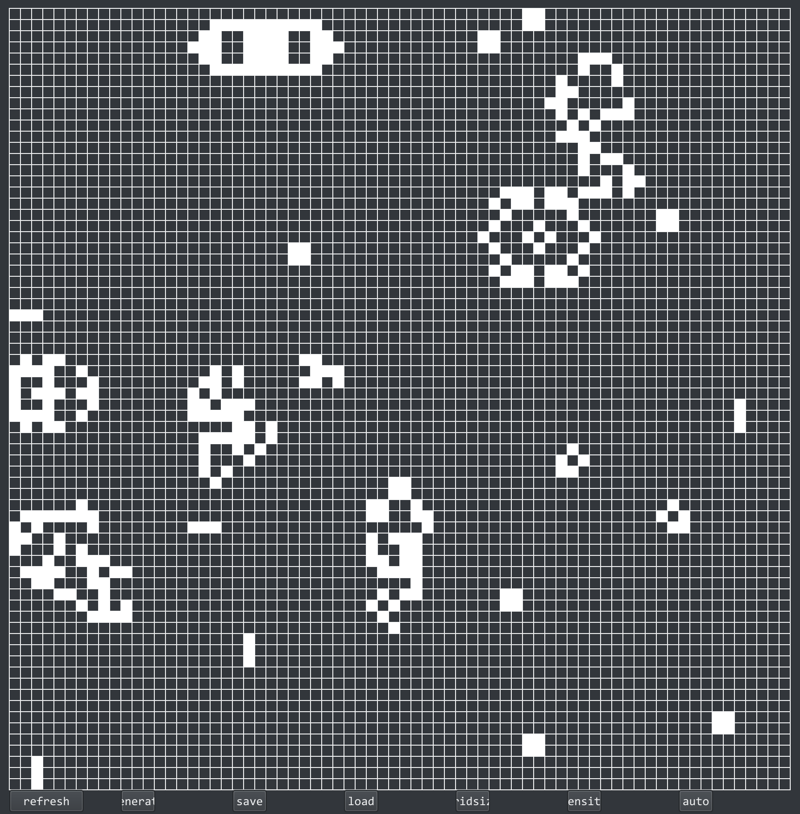

# Conway's Game of Life

John Conway's Game of Life, implemented in C++ using Qt6, and built with cmake. Builds have been tested on Debian 10 and macOS 12 with success.

> **Note:** The cellular automaton occurs in a **finite** (although size scalable) two-dimensional orthogonal grid of square cells. The decision to use a finite universe contradicts the pre-determined rules defined by John Conway for the Game of Life. However, a pseudo-infinite universe can be achieved by substantially increasing the universe size, whilst limiting the time n to avoid live cell collision with the universe boundaries.

## implemented functionality

- manual time iteration (by n+1)
- automatic time iteration (by n+40, with drawn cells refreshed/updated per n+1)
- ability to manually regenerate (reset) the cellular automaton
- specify the spawn density (generated level of pseudo-randomness that a cell will be alive/dead at n)
- save current state to json
- load state from json
- specify grid size

see [Conway's Game of Life]() section 'Rules' for the algorithm logistics.

